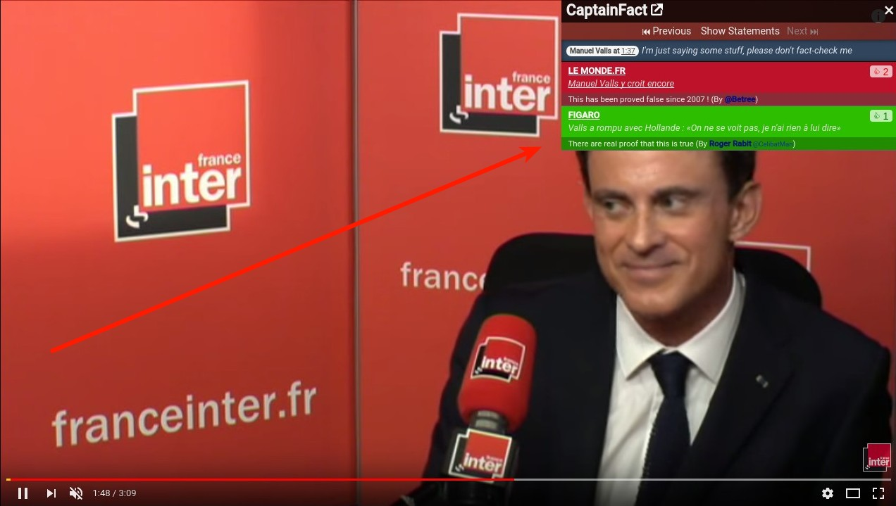

<h1 align="center"><a href="https://captainfact.io">CaptainFact.io</a></h1>
 

## Extension Features

### Icon helper

A small icon appears when you're watching a video that has been verified on CaptainFact.io. It
tells you, based on votes, if the statement you're hearing (or what is shown) is believed to be
true or false.

### Facts overlay 

When clicked, the CaptainFact icon displays facts and comments about current statement and
their respective scores.

## Installation

The application is available on the
[Chrome Web Store](https://chrome.google.com/webstore/detail/captainfact-beta/fnnhlmbnlbgomamcolcpgncflofhjckm)

## How does it work ?

We store a local cache of videos ids that exist on CaptainFact. This cache gets updated if you watch a video on Youtube
and it haven't been synced for more than 5 minutes. 
This is a privacy improvement that guarantees we don't track the videos you're watching and don't send unnecessary 
requests.

## Development

See [CONTRIBUTING.md](CONTRIBUTING.md)

## Linked projects

* [Frontend](https://github.com/CaptainFact/captain-fact-frontend)

## License

GNU General Public License v3.0

Permissions of this strong copyleft license are conditioned on making available complete source code of licensed works and modifications, which include larger works using a licensed work, under the same license. Copyright and license notices must be preserved. Contributors provide an express grant of patent rights.

See [LICENSE](LICENSE) for more info.
