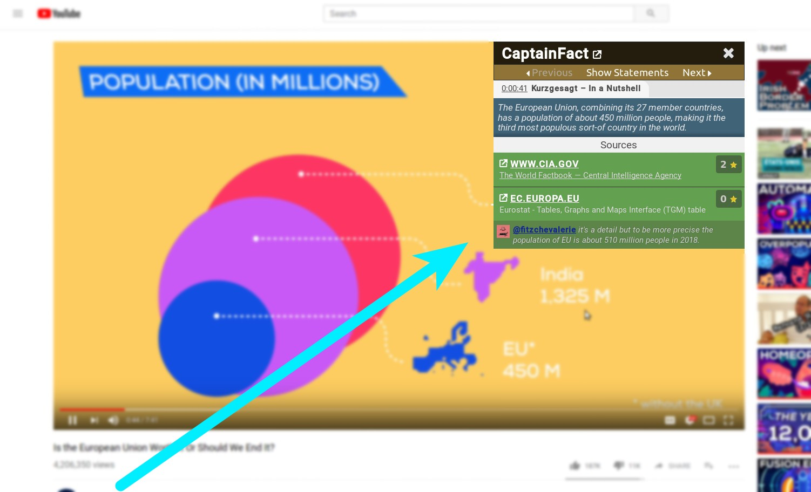

<h1 align="center"><a href="https://captainfact.io">CaptainFact.io</a></h1>

<table>
  <thead>
    <tr>
      <th>Community</th>
      <th>Master</th>
      <th>Staging</th>
    </tr>
  </thead>
  <tbody>
    <tr>
      <td>
        
        
        
      </td>
      <td>
        
        
      </td>
      <td>
        
        
      </td>
    </tr>
  </tbody>
</table>

## Extension Features

### Icon helper

A small icon appears when you're watching a video that has been verified on CaptainFact.io. It
tells you, based on votes, if the statement you're hearing (or what is shown) is believed to be
true or false.

### Facts overlay 

When clicked, the CaptainFact icon displays facts and comments about current statement and
their respective scores.

## Installation

The application is available on the
[Chrome Web Store](https://chrome.google.com/webstore/detail/captainfact-beta/fnnhlmbnlbgomamcolcpgncflofhjckm)
and for [Firefox](https://addons.mozilla.org/en-US/firefox/addon/captainfact/)

## Development

* Install (if you don't have them):
  * [Docker](https://docs.docker.com/install/) (to start the API easily)
  * [Node.js](http://nodejs.org)
  * App dependencies: `npm install`
  
* Run:
  * `./captain-fact-overlay-injector/dev/start_graphql_api.sh` - Start the GraphQL API. You can access GraphiQL at http://localhost:4002/graphiql
  * `npm start` - Start the overlay injector test pages on http://localhost:3342
  * `npm run test` - run all unit tests

## FAQ

* Why do you need storage permissions ?

We store a local cache of videos ids that exist on CaptainFact. This cache gets updated when you visit Youtube
if it's older than 15 minutes. This is a privacy improvement that guarantees we don't track the videos you're 
watching and don't send unnecessary requests.

* Why do you need tabs permissions ?

Because we inject script programmatically from background (only if video is known from cache) and
to be able to disable CaptainFact on all tabs when you unselect it from extension popup.

You can check by yourself in `chrome/extension/background.js` (look for `chrome.tabs.`)

* Why do you need Youtube permissions ?

To be able to inject the facts overlay on Youtube videos.

* Why do you only inject on youtube.com and not in embedded players everywhere else ?

We may want to implement this in a separate release in the future. We don't want to implement
this feature in main extension cause it means asking for permissions to access all your sites. 

* Can I add sources on videos directly from the extension ?
 
Not at the moment.

## Linked projects

* [Frontend](https://github.com/CaptainFact/captain-fact-frontend)
* [Overlay Injector](https://github.com/CaptainFact/captain-fact-overlay-injector)

## License

GNU General Public License v3.0

Permissions of this strong copyleft license are conditioned on making available complete source code of licensed works 
and modifications, which include larger works using a licensed work, under the same license. Copyright and license 
notices must be preserved. Contributors provide an express grant of patent rights.

See [LICENSE](LICENSE) for more info.
